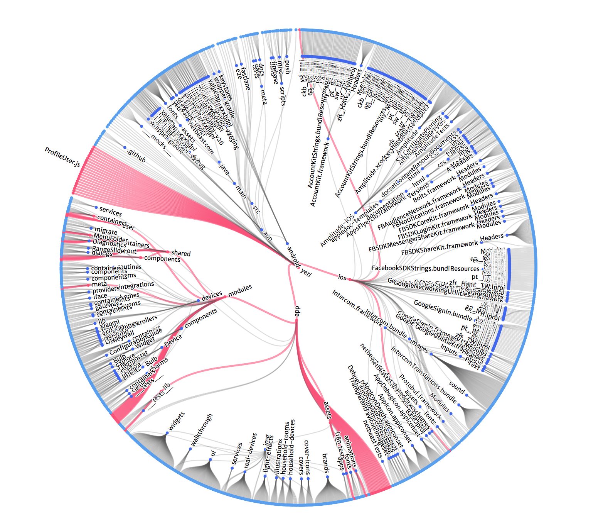
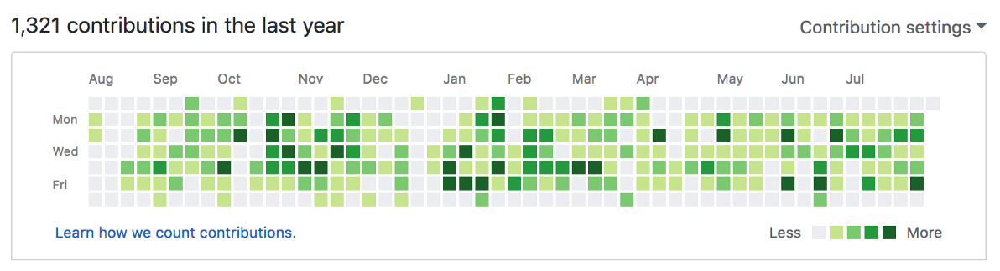
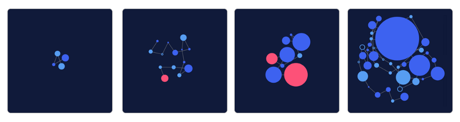
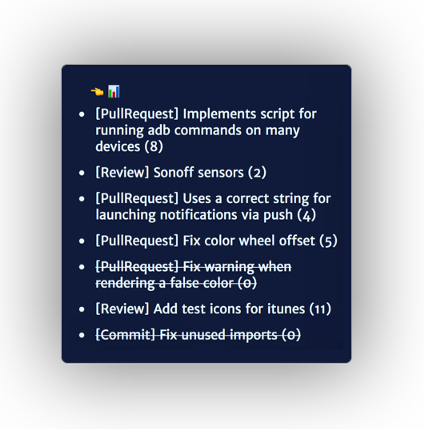
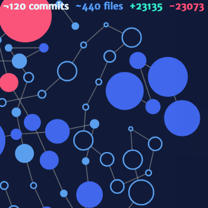
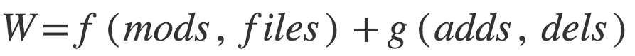
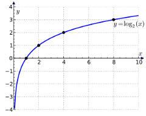
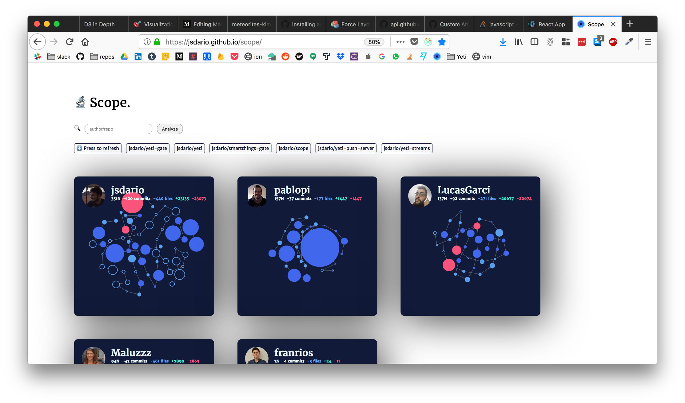

#Measuring Developer Productivity

*This post covers how to measure a coder’s contribution to an organization, in a sensible & precise way.*

Pictured Above: Visualization of a PR on Yeti Smart Home (https://getyeti.co) codebase

Code crafting, as any other job based on knowledge, is many times more art than science. Decision making is of a huge importance, and every decision, technical or not, has many side effects. So you can’t just “measure” a developer’s output in a numerical way, it wouldn’t be fair.

Let’s start assuming you are using a version control system, as **git**. The simplest way would be to measure code modifications (line or file additions, deletions) and commit frequency. Many readers will be familiar to **github**’s contribution activities chart.

(Last year contributions on GitHub of [https://github.com/jsdario](https://github.com/jsdario.com))

Which is a great way to measure activity and, why not, brute numerical output. But if you want to use this as a metric for “productivity” within an organization you’ll be wrong. In fact, as soon as you try, you will encounter the following issues:

- Bugs thrive on projects where code output is bigger than their quality assurance capacity. Also…
- [Automated tests, per se, do not increase our code quality](https://softwareengineering.stackexchange.com/questions/192/is-test-coverage-an-adequate-measure-of-code-quality) but do need code output
- Commit frequency and line output of junior engineers is normally going to be higher than those of seniors, but can be of less relevance. As is the case of …
- Choosing short term solutions over more thoughtful interfaces to solve a problem. It will usually require us to output more code in absolute terms but also add [technical debt](https://softwareengineering.stackexchange.com/questions/135993/how-can-i-quantify-the-amount-of-technical-debt-that-exists-in-a-project).

> (From junior to project lead, 4 developer contribution profiles in a 30 day row)

Probably there are more points I am missing, this is just to mention a few. Many companies (and investors) do not measure “developer productivity”. Instead, it is derived from the product metrics. This approach is much better as **the speed to deliver and quality** of the resulting product –in terms of good customer reviews, or number of issues per week– **is no more than a reflection of the team performance**. Even though you’d be including designers 👩‍🎨, support 💁‍♀️ and other team members, this approach is more correct than brute output.

However, we can’t improve the things we don’t measure. We would be missing a number of opportunities:

- We won’t be able to track the evolution of new team members.
- We won’t be able to prevent lack of motivation.
- We won’t be prepared to experiment ways to improve our productivity, without testing it to a hard framework.

Yes, we can always use qualitative approaches. Indeed, they are far better than nothing. Nevertheless, there is nothing like hard data. To avoid reducing people to numbers, and keep the best of qualitative analysis, the better way to measure developer’s impact won’t be a ladder, but data visualization. Since every team and project are different, we must use tools that allow us to perceive the activity of the developers in a way that is meaningful to the organization.

I’ve been investing some –very little– free time during the last months to create a Minimum Viable Product that would serve our team. The idea is [🔬 Scope](https://scope.ink) and this article tries to explain why it works for us.

##The workflow

The most part of the engineering team is working in Yeti Smart Home, a React Native app, that runs on both iOS and Android, on a single repo. In addition, we have a dozen other bots and services in the form of web APIs, each one on a separate repository. This article therefore will not focus to organizations that runs on [monorepos](https://developer.atlassian.com/blog/2015/10/monorepos-in-git/), but can be easily adapted.

**Planning**

We try to apply Lean Startup principles and agile development methods as possible, with all human good and bad practices, in our imperfect ways. Experiments, product features, enhancements and bug fixes are always divided in a set of **shippable pull requests** (PRs). This is crucial, and a principle of [continuous delivery](https://www.atlassian.com/continuous-delivery/principles/continuous-integration-vs-delivery-vs-deployment).

A PR represents the minimum unit of added value that transforms the current product into something better, therefore the **minimum unit of meaningful work**. Such codebase modification must, therefore be able to be published to the store / deployed at a server. This encourages them to be the smallest possible, while keeping value. A feature might be (if necessary) split into several releases during various sprints. We can quantify the volume of work here (now yes) by files and modifications, because that will represent mechanical time investment into typing, searching and replacing, running [codemods](https://github.com/facebook/codemod), etc.

**Quality**

Every PR must be reviewed and tested before being merged. Both automatically and manually. Automatic tests may fail, but the PR can be still merged if the reviewer decides so. **A review, therefore is another minimum unit of meaningful work**, where time spent is of importance for the company. They also are the biggest transfer of knowledge between developers. There we point out each other approaches to implement a feature or use the syntax. It’s another elegant way to teach and learn, without explicitly pair programming.

> (Example of scores of different work units)

We try only to write regression tests when bugs occur, to prevent them from happening again, or invest in integration tests only when they can cover a huge surface of the software use case. This means we mostly write regression tests for the app and integration tests for web servers, where we can achieve 100% coverage easily. We also have a [diagnose suite](https://github.com/netbeast/react-native-diagnose), to test hard features and the interaction between services in production environment.

There are several bots that test each PR automatically ([business model tests](http://travis.com/), [application build tests](https://www.bitrise.io/) and [checks for good practices](https://danger.systems/)). **This gives the PRs other dimensions that are useful to measure** in a precise way: (1) whether the developer does not create regressions bugs, (2) coverage increases or decreases, (3) requires changes on the testing infrastructure because tests are failing, but –adds technical debt — needs to be merged.

Bots and automatic tests are important, they are a reactive, implicit, way to teach about the code base infrastructure. Just like peer reviews.

####About efficiency of contributions and measurement

The ping-pong of rejecting a PR ⏭ commit to please the reviewer ⏮ on a single PR is not productive. A lot of time can be wasted in communication, especially when the reviewer is focused and could submit a hotfix to merge the PR in the moment. We want to encourage this behavior, so will consider these commits valuable on their own, as a **third unit of meaningful work**. On the contrary to commits pushed to master, which we want to discourage, because they are not reviewed (thus no transfer of knowledge) and are net contributors of regressions.

>(Empty circles are hotfixes or commits on a PR created by another colleague)

Another fair point on quantitative measurement is that whether the algorithm we use to measure all these contributions (pull requests, reviews, hotfixes and independent commits) one thing is certain: we will overstimate some work units, and underestimate others. This means: (1) Don’t trust ladders and pure numerical scores, visualizations are the way to digest this kind of information. (2) On the long run, the algorithm is still valid, because the +/- shifts are a zero-sum game. This is of much importance every single time we are in front of any analytics system, when jumping to conclusions. Do. Not. Rush.

####The visualization algorithm

*As of September 2018*

**Links**

At the moment, it is rather simple. You can search for a number of repos you have push access to. Work units of the same repo (pulls, reviews, hotfixes) are going to be appear linked. Different chains mean that different work units have been performed across projects: more responsibility and impact for the organization.

>(Different repos are not linked, thus are separate “islands”)

Links add to the global score, or “force” of each graph, and it’s calculated in the end.

**Reviews**

Review sizing is easy: they should amount for the 20%-40% of the PR weight, plus all the comments invested (to incentivize the share of knowledge and corrections). We also want to discourage “Looks Good To Me 👍” reviews, so it is important to emphasize that the workflow is (normally) respected in the company. PRs are reproduced locally, tested manually, read and reviewed. So it does imply a number of valuable steps.

**Pull requests**

Pull requests score is a function of **mods** (lines added + deleted), **absolute mods** (the number of different lines after the PR is merged, can be 0 if the number of additions and deletions are the same) and changed files. The original idea was to also consider the number of commits of the PR, but I am still considering how to improve this. Again this is a question of more art than science.

>(PR weight is a function of mods and files plus a function of absolute changes)

>>>I wanted to enter into detail on how to build the functions above, but they are yet being perfectioned, and part of the project’s core 
>>>value. I’d like create a post on their own, on how to transform qualitative observations into quantitative values.

**Commits**

Everyone commits differently. What I try to teach the devs I mentor is to make such quantum steps that I could time travel to different stages of a PR that make sense on their own. Pretty much like “merged PRs must always be shippable”, but in a softer way. Committing more adds –maybe– more definition for a PR implementation, but I don’t think it should affect the size, or the quality of it. Some days you are more tired and either find that committing more is helpful, or creates fatigue.
I wanted to reflect the impact of committing on the visualization, and so I started tinkering with opacity, or projecting different borders and shadows. Right now, commits are not reflected onto [Scope 🔬 charts](https://scope.ink).

####Hotfixes

In contrast, individual commits (hotfixes) for other colleagues’ PRs are sizable, and use the same approach than PRs themselves, mods, absolute mods and changed files.

####Corrections and achieving better accuracy

When the number of files or mods is huge, the algorithm chooses to weight them logarithmically against their scalar value. This makes sense: automatic modifications as search and replace or codemod change a lot of lines, but do not add value themselves. They are normally the means to an end. Search and replace of a 1000 line mod should may not count as if 1000 were lines modified manually, but maybe it’s the equivalent of modifying 7 lines [Math.log(1000) = 7].

>(Abnormal number of lines modified automatically should not score as if manually)

At the same time, merge commits within PRs are punished heavily. We try to encourage **rebasing over merging**, because it promotes a workflow that benefits all.

1. When rebasing, conflicts are very painful to resolve. This encourages smaller PRs and discourages working on the same folder / files as peers
2. Rebasing encourages working with the last copy of master. Delaying so will cause conflicts from other peers refactors, that you want to avoid (1)
3. History is easily readable. This is mainly a whim
4. [Rebasing is not panacea](https://medium.com/@fredrikmorken/why-you-should-stop-using-git-rebase-5552bee4fed1). If you go crazy just merge™Other quality parameters of the submitted work

Other dimensions of the PR that could count to measure it have been mentioned already, but are not yet implemented on https://scope.ink. These are: number of CI checks passed (full compliance should be rewarded, CI failures punished) and increment / decrement of test coverage.

####Scope 🔬 as a product

It has been designed with a lot of restrictions: only developers, only GitHub’s API, requires a certain workflow to be meaningful… However it can give insights that are very valuable to many teams. Saving potentially thousands of man hours, and giving immediate feedback of processes that are obscure to other teams.

> (Scope 🔬 prerelease preview)

This model of work analysis based on content, quality of the content, review and size, can be exported to other fields where APIs are available. Mailing / meetings, trello / jira projects. It would be interesting to mix different sources with parameters to reveal other hidden patterns from different teams (support, design, revenue)

I am open to develop further into it, or releasing the source, depending on how things develop after this first release. Hope to get some valuable feedback from teams out there.

Please visit https://scope.ink and give some feedback!

