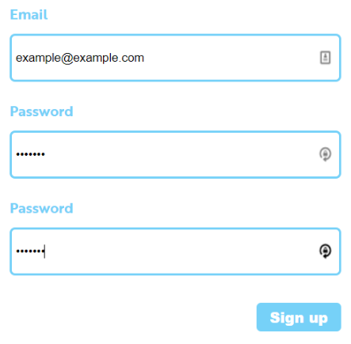
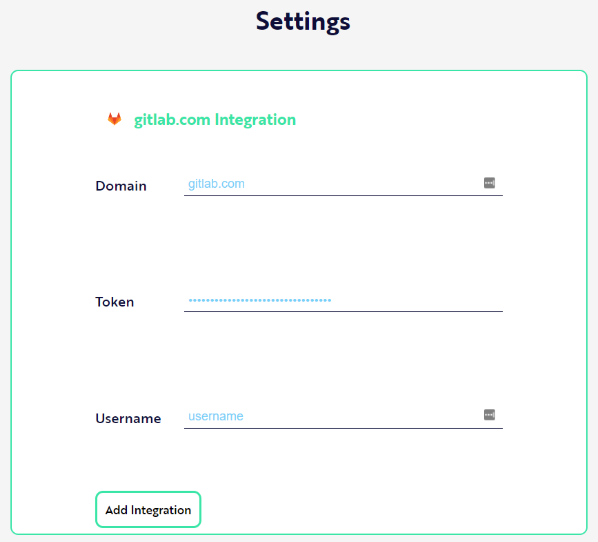

# Scope now works with 🦊GitLab!

Today there are good news for the community of developers. **[Scope](https://scope.ink) is now integrated with [GitLab](https://gitlab.com)**. We have been receiving precious feedback from you guys so we have been working really hard to fulfill your expectations! 🎉

GitLab is now on production on Scope.ink. However, the status of GitLab is Beta stage. Anyways, you can analyze for free your GitLab private repositories with [Scope](https://scope.ink).

`We are open to keep receiving feedback from you, so we can improve our software, insights and processes.`

>>> *If you don’t know how Scope actually works, you can read this publication on [Hackernoon](https://hackernoon.com/measure-a-developers-impact-e2e18593ac79) and check this [YouTube video](https://www.youtube.com/watch?v=BoJqyCcm-DU).*

## How to install GitLab on Scope.ink

If you are asking how to use it with Scope, we have prepared a GitLab integration tutorial so you can do it very easily.

First of all, sign in in your GitLab account. Then, you have to create a personal token from the GitLab settings panel. To do that, you have to:

>>> 1. Log in to GitLab.
>>> 2. In the upper-right corner, click your avatar and select **Settings**.
>>> 3. On the **User Settings** menu, select **Access Tokens**.
>>> 4. Choose a name and optional expiry date for the token.
>>> 5. Choose the *desired scopes*.
>>> 6. Click the **Create personal access token button**.
>>> 7. Save the personal access token somewhere safe. Once you leave or refresh the page, you won’t be able to access it again.

Later, you have to Create an Account in Scope.ink. To do that, go to the main page of Scope and press Sign Up button.

>>> 1. Go to the main page of [Scope.ink](https://scope.ink)
>>> 2. Press **Sign Up** Button

>>> 3. Insert your **e-mail** and **password**. Retype the password just to make sure they match.

>>> 4. Insert your **Domain** (*by default is gitlab.com*)
>>> 5. Insert the **token** you have created in GitLab
>>> 6. Insert your **username**

Lastly, insert the following data:

>>>* Domain: by default is gitlab.com
>>>* Token: your created token
>>>* Username: your GitLab’s username

And **that’s all**! After this process, you can analyze your private and public repositories with Scope. 

This way, you can measure developer productivity and analyze your team workflow! 👷🏻‍

*If you have any question or inquiries, please, don't hesitate to [contact us](mailto:team@scope.ink) through e-mail or find us on [Twitter](https://twitter-com/scope_ink) or [LinkedIn](https://www.linkedin.com/company/scope-ink)*

.

